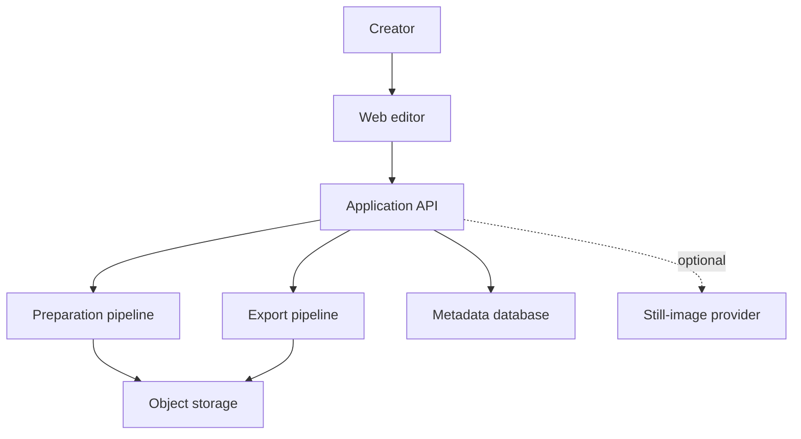
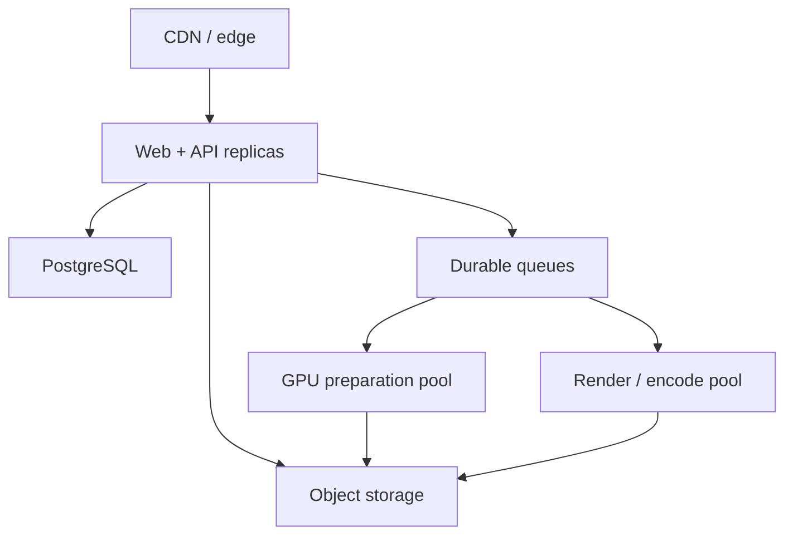
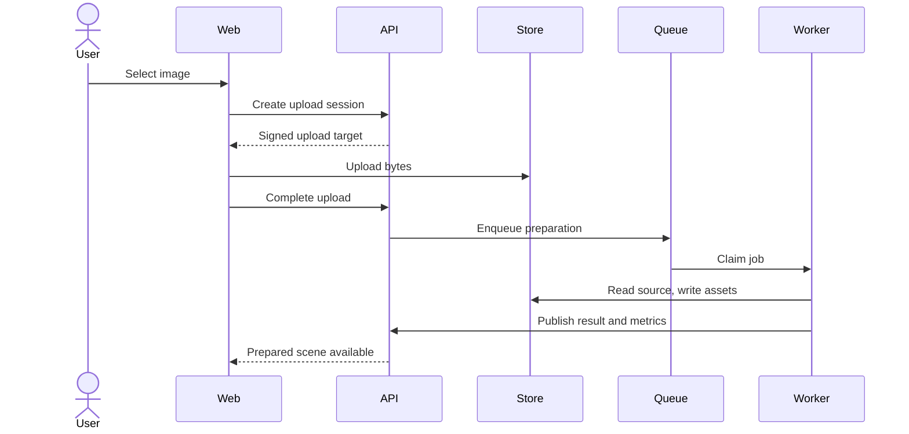
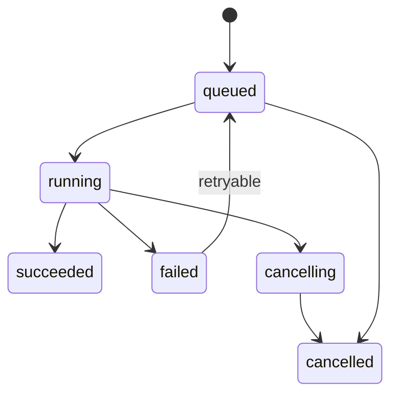

# Still Image Animation Platform — Architecture Design

**Status:** Proposed  
**Version:** 1.0  
**Date:** 2026-09-02  
**Audience:** Product, frontend, backend, ML, graphics, platform, and security engineers

## 1. Executive summary

This document defines a production architecture for a web platform that turns a single still image into a short, convincing animated shot without using a generative video model.

The system uses AI only during one-time scene preparation:

- optional still-image generation;
- monocular depth estimation;
- subject and region segmentation;
- optional background inpainting;
- optional face and body landmark detection.

Animation frames are then rendered deterministically using Three.js/WebGL, shaders, transforms, particles, and mesh deformation. The prepared scene can be previewed, edited, and exported repeatedly without rerunning expensive AI inference.

The primary economic principle is:

> AI creates reusable scene assets; the renderer creates motion.

The first release should prove one experience: upload or generate an image, estimate depth, select a camera preset, preview a 3–5 second 2.5D animation, and export it as MP4 or WebM.

## 2. Goals and non-goals

### 2.1 Goals

- Produce polished motion from one still image at substantially lower cost than video diffusion.
- Preserve source identity, composition, color, and object appearance.
- Support real-time browser preview on modern desktop and mobile devices.
- Make animation deterministic and reproducible from a versioned scene specification.
- Reuse prepared assets across any number of previews and exports.
- Degrade gracefully when depth or segmentation quality is poor.
- Keep AI models and image-generation providers replaceable.
- Support asynchronous, observable, retryable processing.
- Enforce tenant isolation, signed asset access, quotas, and retention policies.

### 2.2 Non-goals for the MVP

- Text-to-video or image-to-video diffusion.
- Large body movement, walking, dancing, or arbitrary pose changes.
- Accurate novel-view synthesis or unrestricted camera orbits.
- Full 3D reconstruction or relighting.
- Speech, lip synchronization, or audio generation.
- Collaborative timeline editing.
- Native desktop or mobile applications.

## 3. Product scope

### 3.1 Primary user journey

1. The user uploads an image or generates one through a still-image provider.
2. The platform validates, normalizes, and stores the source image.
3. A preparation job estimates depth and creates a reusable scene package.
4. The editor opens with a default camera preset and real-time preview.
5. The user adjusts motion, depth strength, crop, duration, and effects.
6. The user requests an export.
7. A render worker produces and encodes the final video.
8. The user downloads or shares the output.

### 3.2 Quality modes

| Mode | Preparation | Rendering | Intended use |
|---|---|---|---|
| Fast | normalized source + depth | single depth mesh + camera presets | instant experiments |
| Standard | depth + subject segmentation + optional background fill | layered parallax + effects | default production mode |
| Cinematic | refined masks, depth cleanup, landmarks, background reconstruction | layered meshes, local deformation, particles, post-effects | highest deterministic quality |

## 4. Requirements

### 4.1 Functional requirements

| ID | Requirement |
|---|---|
| FR-01 | Accept JPEG, PNG, and WebP uploads within configured size and resolution limits. |
| FR-02 | Optionally generate a source image through a pluggable image-generation adapter. |
| FR-03 | Normalize orientation, color space, dimensions, and metadata. |
| FR-04 | Estimate a depth map for every accepted source image. |
| FR-05 | Optionally segment subject, foreground, background, sky, hair, and effect regions. |
| FR-06 | Optionally reconstruct pixels hidden behind separated subjects. |
| FR-07 | Store immutable, versioned scene assets and editable scene parameters. |
| FR-08 | Preview deterministic animation in the browser. |
| FR-09 | Support camera push, pull, pan, drift, float, and subtle handheld motion. |
| FR-10 | Support configurable parallax, light, fog, dust, rain, snow, and vignette effects. |
| FR-11 | Export MP4 and WebM at supported aspect ratios, resolutions, durations, and frame rates. |
| FR-12 | Report preparation and export status, progress, warnings, and failures. |
| FR-13 | Permit retries, cancellation, and idempotent job submission. |
| FR-14 | Delete projects and associated assets according to retention rules. |

### 4.2 Non-functional requirements

| Area | Initial target |
|---|---|
| API availability | 99.9% monthly excluding third-party image generation |
| Editor load | p95 under 3 s after prepared assets are available |
| Preview | 24–60 FPS, adaptive to device capability |
| Fast preparation | p95 under 20 s on a warm GPU worker |
| Standard preparation | p95 under 60 s, excluding optional provider calls |
| Export | p95 under 2× video duration for 1080p/30 FPS on a render worker |
| API latency | p95 under 300 ms for non-upload, non-job endpoints |
| Durability | source and completed export assets stored redundantly |
| Recovery | RPO ≤ 24 h, RTO ≤ 4 h for metadata control plane |
| Isolation | no cross-tenant object or metadata access |
| Reproducibility | identical scene version and renderer version produce equivalent output |

Targets are hypotheses until measured on the selected infrastructure and representative images.

## 5. Architecture principles

1. **Prepare once, render many.** Expensive image understanding is cached by source content hash and pipeline version.
2. **Deterministic first.** Use transforms, geometry, masks, and shaders before any generative operation.
3. **Bound camera motion.** Small movement preserves quality; presets enforce safe displacement limits.
4. **Progressive enhancement.** Depth-only scenes remain valid when segmentation or inpainting fails.
5. **Immutable assets, versioned intent.** Source-derived assets are immutable; edits create scene versions.
6. **Browser preview, server export.** The same scene contract drives both paths, with documented capability differences.
7. **Asynchronous heavy work.** Model inference and export run behind durable queues.
8. **Provider abstraction.** Model and image-generation vendors sit behind internal interfaces.
9. **Cost is a first-class signal.** Jobs record estimated and actual compute and provider cost.
10. **Untrusted media stays isolated.** Decode and metadata extraction occur in constrained workers.

## 6. System context



## 7. Logical architecture

### 7.1 Components

| Component | Responsibility | Suggested implementation |
|---|---|---|
| Web application | project UI, upload, editor, preview, export controls | Next.js, React, TypeScript |
| Preview renderer | depth mesh, layers, camera, effects, quality adaptation | Three.js/WebGL 2; WebGPU later |
| API gateway/BFF | authentication, validation, orchestration, signed URLs | Next.js server or TypeScript service |
| Project service | projects, scenes, versions, permissions, lifecycle | TypeScript service |
| Asset service | upload sessions, hashes, metadata, signed object access | TypeScript service |
| Job service | idempotency, status, retries, cancellation, progress | TypeScript or Python service |
| Preparation orchestrator | executes the versioned image-processing DAG | Python service |
| Depth worker | monocular depth inference and normalization | Python, PyTorch/ONNX/TensorRT |
| Segmentation worker | prompted or automatic region masks | Python model worker |
| Inpainting worker | one-time background reconstruction | optional GPU worker/provider |
| Landmark worker | face mesh and pose points | MediaPipe or equivalent |
| Export orchestrator | resolves scene version and coordinates render | TypeScript/Python service |
| Render worker | headless deterministic frame rendering | headless Chromium + Three.js, or native renderer |
| Encoder | frame-to-video encoding and muxing | FFmpeg |
| Object storage | sources, derived assets, thumbnails, exports | S3-compatible storage |
| Metadata database | transactional application and job state | PostgreSQL |
| Queue | durable preparation and export jobs | SQS, Pub/Sub, RabbitMQ, or Redis Streams |
| Cache | hot metadata, rate limits, job progress | Redis |
| CDN | delivery of images, scene assets, and exports | managed CDN |
| Telemetry | logs, metrics, traces, model and render quality | OpenTelemetry stack |

### 7.2 Deployment topology



The control plane should scale independently from GPU preparation and CPU/GPU rendering. Preparation workers can scale to zero in low-volume environments. Export workers should be isolated from API nodes because headless rendering and encoding are resource intensive.

## 8. Core workflows

### 8.1 Upload and preparation



Preparation DAG:

1. Verify content type, byte size, dimensions, and decode safety.
2. Strip metadata unless explicitly retained.
3. Apply EXIF orientation and convert to sRGB.
4. Create normalized source, thumbnail, and content hash.
5. Estimate raw depth.
6. Normalize, smooth, and edge-refine depth; save 16-bit lossless output when supported.
7. In Standard/Cinematic mode, generate subject and region masks.
8. In Cinematic mode, optionally detect landmarks and inpaint a clean background.
9. Validate asset dimensions and alpha conventions.
10. Write a scene manifest and mark the scene `ready`, `ready_with_warnings`, or `failed`.

Each node stores its input hash, implementation version, model version, parameters, duration, and output hash. A node can be reused only when all cache keys match.

### 8.2 Real-time preview

1. The editor requests the latest scene version and short-lived asset URLs.
2. The browser downloads the normalized source, depth map, masks, and scene JSON.
3. The renderer selects a capability tier based on texture limits, memory, and benchmark results.
4. The renderer builds a depth mesh or layered planes.
5. A fixed animation clock evaluates camera and effect parameters.
6. The editor updates parameters locally at interactive speed.
7. Changes are debounced and persisted as a new draft revision.

Preview quality may use a smaller mesh, reduced particles, and half-resolution effects. It must preserve camera framing and timing so the export remains predictable.

### 8.3 Export

1. The client saves the draft and submits an export request with an idempotency key.
2. The API freezes an immutable scene version and validates plan limits.
3. The export orchestrator resolves all asset hashes and the renderer build.
4. A worker renders frames using a fixed timestep: `t = frameIndex / fps`.
5. FFmpeg encodes frames, attaches color metadata, and creates MP4 or WebM.
6. The worker creates a thumbnail/poster, uploads outputs, and records checksums.
7. The API marks the export complete and emits a user notification event.

Retries must reuse the same frozen scene and renderer versions. Partial frames live in ephemeral worker storage and are deleted after completion or failure.

## 9. Scene representation

### 9.1 Scene package

```text
scene/{sceneId}/{pipelineVersion}/
├── source.webp
├── thumbnail.webp
├── depth.png
├── subject-mask.png          # optional
├── subject.webp              # optional
├── background.webp           # optional
├── region-masks/             # optional
├── manifest.json
└── quality-report.json
```

Object keys are implementation details; clients receive logical asset IDs and signed URLs rather than storage paths.

### 9.2 Scene document example

```json
{
  "schemaVersion": "1.0",
  "sceneId": "scn_01...",
  "sceneVersion": 7,
  "pipelineVersion": "prep-1.3.0",
  "rendererVersion": "render-1.5.2",
  "canvas": {
    "width": 1920,
    "height": 1080,
    "colorSpace": "srgb"
  },
  "timeline": {
    "durationMs": 5000,
    "fps": 30,
    "loop": false
  },
  "assets": {
    "source": "ast_source",
    "depth": "ast_depth",
    "subjectMask": "ast_subject_mask",
    "background": "ast_background"
  },
  "camera": {
    "preset": "slow_push",
    "from": { "x": 0, "y": 0, "z": 2.0, "roll": 0 },
    "to": { "x": 0.03, "y": 0, "z": 1.82, "roll": 0 },
    "easing": "easeInOutCubic",
    "safeCrop": 0.08
  },
  "depth": {
    "strength": 0.15,
    "near": 0.1,
    "far": 1.0,
    "edgeProtection": 0.7
  },
  "layers": [
    { "id": "background", "asset": "ast_background", "z": -0.3 },
    { "id": "subject", "asset": "ast_source", "mask": "ast_subject_mask", "z": 0.1 }
  ],
  "effects": [
    { "type": "dust", "enabled": true, "intensity": 0.2, "seed": 81273 }
  ]
}
```

### 9.3 Contract rules

- All random effects require an explicit seed.
- Coordinates use normalized canvas space unless stated otherwise.
- Time is expressed in milliseconds at API boundaries and seconds internally in shaders.
- Unknown fields are ignored for forward compatibility; unknown required feature types fail validation.
- Schema migrations are additive when possible.
- Published scene versions are immutable.
- Asset references resolve to immutable content hashes.

## 10. Rendering design

### 10.1 Depth mesh

The baseline renderer creates a subdivided plane, maps image UVs to the source texture, samples the depth texture in the vertex shader, and displaces each vertex along Z.

Conceptually:

```glsl
float d = texture(depthMap, uv).r;
float z = mix(depthNear, depthFar, d) * depthStrength;
position.z += z;
```

The production shader also applies depth range normalization, edge-aware damping, safe overscan, and optional mask-based discontinuity protection.

### 10.2 Layered parallax

Standard mode separates a subject from a reconstructed background. Each layer has its own Z position and optional local mesh. Layer separation reduces stretching at depth discontinuities and permits controlled subject motion.

Recommended draw order:

1. reconstructed background depth mesh;
2. midground planes or meshes;
3. subject cutout with feathered alpha;
4. foreground occluders;
5. depth-aware particles and overlays;
6. post-processing.

### 10.3 Safe motion envelope

Large camera movement reveals missing pixels and amplifies depth errors. Each scene receives recommended camera bounds based on depth discontinuities, available overscan, background reconstruction, and target aspect ratio.

The editor should warn or clamp when parameters exceed the safe envelope. Default limits should be conservative: subtle push/pull, horizontal drift of only a few normalized percentage points, and very small orbit angles.

### 10.4 Cheap motion effects

| Effect | Implementation |
|---|---|
| Pan/zoom/roll | camera or canvas transform |
| Handheld | seeded low-frequency noise on camera position/rotation |
| Light flicker | seeded noise over exposure, warmth, and local overlays |
| Dust/snow/rain | instanced GPU particles with depth bands |
| Fog | scrolling tiled noise with depth-aware opacity |
| Water ripple | masked UV displacement shader |
| Hair/clothing sway | masked mesh deformation driven by sine/noise fields |
| Breathing | low-amplitude masked torso deformation |
| Blink | landmark-derived local mesh deformation; optional later feature |

### 10.5 Browser/server parity

The preferred approach is a shared TypeScript renderer package used by the web editor and headless export worker. Shader sources, easing functions, seeded random functions, scene validation, and preset definitions must be shared.

Exact pixel parity is not guaranteed across GPU drivers. Acceptance should focus on framing, timing, geometry, and bounded perceptual differences. Golden rendering tests run on a pinned export image and browser version.

## 11. Data model

| Entity | Important fields |
|---|---|
| User | id, tenant_id, plan, status |
| Project | id, tenant_id, owner_id, title, status, created_at |
| SourceAsset | id, project_id, content_hash, mime_type, dimensions, storage_ref |
| PreparationRun | id, source_asset_id, mode, pipeline_version, status, metrics, cost |
| DerivedAsset | id, run_id, type, content_hash, dimensions, model_version, storage_ref |
| Scene | id, project_id, active_draft_version, status |
| SceneVersion | id, scene_id, version, schema_version, document_json, immutable |
| Export | id, scene_version_id, format, resolution, fps, status, storage_ref |
| Job | id, type, idempotency_key, status, attempt, progress, error_code |
| UsageLedger | id, tenant_id, operation, units, estimated_cost, actual_cost |

Use UUIDv7 or another sortable opaque identifier. Store large binary assets only in object storage. PostgreSQL stores metadata, scene JSON, state transitions, and audit records.

## 12. API design

### 12.1 Representative endpoints

```text
POST   /v1/projects
POST   /v1/projects/{projectId}/uploads
POST   /v1/uploads/{uploadId}/complete
POST   /v1/projects/{projectId}/generate-image
POST   /v1/projects/{projectId}/prepare
GET    /v1/jobs/{jobId}
POST   /v1/jobs/{jobId}/cancel
GET    /v1/scenes/{sceneId}
PATCH  /v1/scenes/{sceneId}/draft
POST   /v1/scenes/{sceneId}/versions
POST   /v1/scenes/{sceneId}/exports
GET    /v1/exports/{exportId}
DELETE /v1/projects/{projectId}
```

### 12.2 API conventions

- JSON APIs use explicit versioning and machine-readable error codes.
- Create/prepare/export endpoints accept an `Idempotency-Key` header.
- Optimistic concurrency uses `ETag`/`If-Match` or a draft revision number.
- Large files use direct signed uploads and downloads.
- Job progress is available by polling; Server-Sent Events can provide live updates.
- Signed asset URLs are short-lived and scoped to one object and method.
- Requests carry a trace ID returned in responses and error payloads.

### 12.3 Job state machine



A lease with heartbeat prevents two workers from owning a job indefinitely. Completion writes use compare-and-set semantics. Retryable failures use exponential backoff with jitter and a maximum attempt count; permanent failures go to a dead-letter queue.

## 13. Model and provider strategy

### 13.1 Internal interfaces

```text
DepthEstimator.estimate(image, options) -> depth asset + confidence metadata
Segmenter.segment(image, prompts, options) -> masks + scores
Inpainter.fill(image, mask, options) -> reconstructed image
LandmarkDetector.detect(image, options) -> normalized landmarks
StillImageGenerator.generate(prompt, options) -> source image + provider metadata
```

Suggested initial classes of implementation include a compact Depth Anything V2 variant for depth, SAM-family segmentation for masks, MediaPipe-class landmark detection, and a still-image generation API or self-hosted diffusion model. These are replaceable choices, not permanent external contracts.

### 13.2 Versioning and rollout

- Record model name, weights checksum, runtime, preprocessing, and parameters.
- Maintain a fixed evaluation corpus covering portraits, landscapes, products, anime, architecture, hair, transparent objects, and low-contrast scenes.
- Shadow-test new versions before rollout.
- Canary by tenant or percentage, with automatic rollback on quality or failure regression.
- Do not silently regenerate old scene assets when models change.

## 14. Reliability and failure handling

| Failure | Response |
|---|---|
| Unsafe or corrupt upload | reject before preparation with actionable error |
| Depth inference timeout | retry on another worker; fall back to 2D pan/zoom if allowed |
| Low depth confidence | reduce depth strength and flag warning |
| Segmentation failure | retain valid depth-only scene |
| Inpainting failure | keep source background and tighten camera bounds |
| Worker loss | lease expires and job returns to queue |
| Export encode failure | retry from frozen scene; retain diagnostic logs |
| Object upload failure | retry multipart upload before committing metadata |
| Provider outage | circuit-break provider; allow user upload path |
| Browser lacks capability | use simplified 2D preview or server-generated proxy |

Asset and database writes follow a commit pattern: upload immutable object, verify checksum, then transactionally publish its metadata. Orphaned objects are removed by a reconciliation job after a safety window.

## 15. Security, privacy, and abuse prevention

### 15.1 Controls

- Authenticate all project APIs and authorize every object by tenant and project.
- Use opaque IDs; never derive authorization from object paths.
- Encrypt traffic in transit and managed storage at rest.
- Use short-lived signed URLs and private storage buckets.
- Decode user media in sandboxed processes with CPU, memory, pixel, and time limits.
- Verify file signatures rather than trusting extensions or client MIME types.
- Strip EXIF/GPS metadata by default.
- Scan uploads and generated files according to platform policy.
- Apply per-user and per-tenant rate, concurrency, resolution, and storage quotas.
- Protect generation prompts and source media from logs; log identifiers and hashes instead.
- Keep secrets in a managed secret store with workload identities and least privilege.
- Record security-relevant mutations in an immutable audit trail.
- Support deletion workflows that cover source, derived assets, exports, caches, and backups according to policy.

### 15.2 Threats to address

- decompression bombs and malicious image decoders;
- tenant IDOR and leaked signed URLs;
- prompt abuse through optional image-generation providers;
- denial of wallet through repeated preparation/export requests;
- shader or scene JSON injection;
- supply-chain risk in model weights, browser packages, and FFmpeg builds;
- unauthorized retention of faces or sensitive source images.

Scene JSON is data, never executable script. Validate it against a strict schema, cap arrays and numeric ranges, and permit only registered effect and easing names.

## 16. Cost architecture

### 16.1 Cost model

For a project with one source image:

```text
total cost = source image creation (optional)
           + one-time preparation inference
           + object storage and delivery
           + deterministic preview/export rendering
```

Unlike video diffusion, inference cost does not grow proportionally with animation frame count. Export compute and bandwidth still grow with resolution, FPS, and duration, but rasterization and encoding are expected to be much cheaper than generative frame synthesis.

### 16.2 Cost controls

- Cache preparation by source hash, mode, parameters, and pipeline version.
- Run depth before optional segmentation and inpainting.
- Use smaller preview assets and meshes.
- Enforce plan-specific maximum resolution, FPS, duration, concurrent jobs, and retention.
- Autoscale GPU workers from queue depth; use warm capacity only where latency requires it.
- Batch compatible depth or segmentation inference when it improves throughput.
- Prefer CPU rendering when benchmarks show acceptable latency; reserve GPU export for expensive effects.
- Delete abandoned drafts and intermediate exports using lifecycle rules.
- Track cost per successful prepared scene and exported minute.
- Set tenant budgets and anomaly alerts.

## 17. Observability

### 17.1 Metrics

- API request count, latency, error rate, and throttling.
- Queue depth, oldest-message age, job wait time, execution time, retries, and dead letters.
- Preparation latency by DAG node, model version, image dimensions, and quality mode.
- GPU utilization, memory, batch size, cold starts, and out-of-memory events.
- Export frames per second, encode speed, failure rate, and output size.
- CDN hit ratio, signed URL failures, storage bytes, and egress.
- Cache hit rate by preparation node.
- Cost per project, preparation, export, active user, and tenant.
- User quality signals: abandoned previews, export completion, manual depth reduction, and reprocessing.

### 17.2 Logs and traces

Use structured logs containing job, project, tenant, scene version, pipeline version, renderer version, worker, and trace identifiers. Do not log raw images, signed URLs, prompts marked private, or face landmarks. Distributed traces should cover API submission through queue wait, processing, object writes, and state publication.

### 17.3 Service-level indicators

- percentage of valid uploads that reach a previewable scene;
- percentage of accepted exports completed within the target time;
- job result correctness, not merely worker success;
- preview/editor availability;
- asset delivery success.

## 18. Testing strategy

### 18.1 Test layers

| Layer | Coverage |
|---|---|
| Unit | scene schema, easing, camera math, safe bounds, state transitions, cost calculations |
| Shader | deterministic inputs, range bounds, mask behavior, NaN/overflow protection |
| Contract | API schemas, worker messages, provider adapters, backward compatibility |
| Integration | upload → prepare → scene → export against local object store and queues |
| Visual regression | pinned scenes rendered on pinned browser/GPU image, perceptual diff thresholds |
| Model evaluation | depth edges, subject separation, portrait identity, failure confidence |
| Load | burst uploads, deep queues, concurrent exports, signed URL delivery |
| Chaos | worker termination, queue redelivery, database failover, object-store timeouts |
| Security | authorization, malicious media, schema fuzzing, quota bypass, dependency scanning |

### 18.2 Acceptance corpus

Maintain licensed test images for portraits, group shots, landscapes, architecture, products, anime/artwork, fine hair, foliage, glass, water, fog, low light, extreme aspect ratios, and images with embedded profiles or EXIF rotation.

Every release records preparation outputs and rendered videos for the corpus. Automated perceptual metrics should be paired with human review because mathematically small differences can still expose severe edge tearing.

## 19. Delivery plan

### Phase 0 — technical spike

**Outcome:** validate that depth-only displacement looks compelling on representative inputs.

- Local depth estimation.
- Three.js subdivided mesh and depth shader.
- Slow Push and Drift presets.
- Browser preview only.
- Visual test corpus and artifact taxonomy.

**Exit criterion:** agreed quality threshold on at least 70% of the initial corpus with conservative camera motion.

### Phase 1 — MVP

**Outcome:** upload to export.

- Authentication and projects.
- Direct uploads and normalized assets.
- Asynchronous depth preparation.
- Versioned scene JSON.
- Six camera presets.
- Browser preview.
- 720p/1080p MP4/WebM export.
- Job status, retries, quotas, telemetry, and deletion.

### Phase 2 — Standard quality

**Outcome:** cleaner portrait and object parallax.

- Subject segmentation.
- Optional background inpainting.
- Layered subject/background renderer.
- Safe motion envelope and artifact warnings.
- Dust, fog, snow, rain, and light effects.
- Cost dashboards and pipeline caching.

### Phase 3 — Cinematic controls

**Outcome:** richer motion without video generation.

- Refined region masks and mask editor.
- Landmark-driven blink/breathing experiments.
- Hair, clothing, and water deformation.
- Keyframes and effect timing.
- Renderer capability tiers and mobile tuning.
- Optional still-image generation provider choices.

## 20. Key risks and mitigations

| Risk | Impact | Mitigation |
|---|---|---|
| Depth errors at boundaries | stretching and tearing | edge-aware depth refinement, segmentation, lower displacement, safe presets |
| Missing pixels during lateral movement | holes around subjects | overscan, background inpainting, movement bounds |
| Flat or inconsistent depth | weak/incorrect parallax | confidence signals, depth controls, fallback to layered planes or 2D motion |
| Preview/export mismatch | user distrust | shared renderer package, frozen versions, golden render tests |
| Mobile GPU limits | crashes or low FPS | capability detection, adaptive mesh/effects, 2D fallback |
| AI worker cost or latency | margin and UX degradation | caching, compact models, batching, autoscaling, progressive pipeline |
| Model license or provider changes | product disruption | provider adapters, weight provenance, replaceable models |
| Inpainting alters source style | visible inconsistency | use only for hidden background; keep subject pixels immutable |
| Determinism varies by GPU | regression noise | pinned export environment and perceptual tolerances |
| Feature creep toward video generation | loss of cost advantage | explicit architecture decision record and per-feature cost budget |

## 21. Architecture decisions

### ADR-001: Exclude generative video from the baseline

**Decision:** Animation frames are not generated by a video diffusion model.  
**Reason:** The product optimizes for low marginal animation cost, predictable output, and source preservation.  
**Consequence:** Motion vocabulary is intentionally constrained; large semantic movement is out of scope.

### ADR-002: Use Three.js as the first renderer

**Decision:** Use Three.js/WebGL for browser preview and share renderer code with a headless export path.  
**Reason:** It aligns with a web engineering stack, offers real-time iteration, and avoids a separate DCC pipeline.  
**Consequence:** Export consistency and headless GPU support require dedicated testing.

### ADR-003: Make scene preparation asynchronous

**Decision:** Depth, segmentation, inpainting, and export are durable jobs.  
**Reason:** Latency and resource use exceed safe synchronous request limits.  
**Consequence:** The product must expose progress, retries, cancellation, and recovery states.

### ADR-004: Store immutable derived assets

**Decision:** Derived assets are content-addressed and immutable; scene edits reference versions.  
**Reason:** This enables caching, reproducibility, rollback, and auditability.  
**Consequence:** Lifecycle management and garbage collection are required.

### ADR-005: Add segmentation only after depth-only validation

**Decision:** Phase 1 uses a depth mesh; segmentation and inpainting arrive when measured artifacts justify them.  
**Reason:** It reduces early infrastructure and validates the central effect quickly.  
**Consequence:** MVP camera movement must remain conservative.

## 22. Open decisions

1. Which still-image generation provider or self-hosted model meets quality, price, licensing, and moderation requirements?
2. Should export use headless Chromium, a native WebGL runtime, or a custom native renderer after benchmarking?
3. Is preparation latency more important than zero-idle GPU cost for the launch workload?
4. Which resolutions, durations, and FPS limits belong to each pricing tier?
5. Is inpainting enabled automatically or only after artifact detection/user opt-in?
6. What retention periods apply to sources, derived assets, failed jobs, and exports?
7. Does the product require multi-region data residency at launch?
8. Which objective and human quality thresholds gate model and renderer releases?
9. Are user edits stored continuously as draft patches or as complete scene snapshots?
10. Should unsupported mobile devices receive a 2D live preview or a server-rendered proxy?

## 23. Recommended first engineering milestone

Build a single vertical slice:

```text
upload image
→ normalize image
→ generate depth map
→ load RGB + depth in Three.js
→ displace a mesh
→ apply a bounded Slow Push preset
→ preview in browser
→ export the same scene to MP4
```

Instrument preparation time, export speed, browser FPS, memory, depth confidence, and a human artifact score. Do not begin segmentation or local character deformation until this slice establishes that the depth effect, renderer parity, and unit economics meet the product threshold.

## Appendix A — Suggested repository layout

```text
apps/
├── web/                    # Next.js editor and account UI
├── api/                    # BFF/application API
└── render-worker/          # headless renderer and FFmpeg orchestration
packages/
├── scene-schema/           # types, JSON schema, migrations
├── renderer-core/          # camera, geometry, effects, shaders
├── presets/                # versioned camera/effect presets
├── api-client/             # generated/typed client
└── telemetry/              # shared logging and tracing
services/
├── preparation/            # Python DAG orchestration
├── depth-worker/           # model runtime
├── segmentation-worker/    # optional model runtime
└── inpainting-worker/      # optional model/provider adapter
infra/
├── environments/
├── modules/
├── dashboards/
└── policies/
tests/
├── corpus/
├── visual-goldens/
├── integration/
└── load/
```

## Appendix B — Definition of done for MVP

- A user can upload a supported image and receive a previewable scene.
- The scene supports at least six bounded camera presets.
- The browser preview remains interactive on supported devices.
- A frozen scene exports to MP4 and WebM with predictable framing and timing.
- Jobs are idempotent, retryable, cancellable, and observable.
- Authorization and tenant isolation tests pass.
- Upload decoder limits and malicious media tests pass.
- Project deletion removes active assets within the documented retention window.
- Cost and latency are visible per preparation and export.
- The visual acceptance corpus meets the agreed pass rate.
- No generative video model is invoked anywhere in the baseline pipeline.
