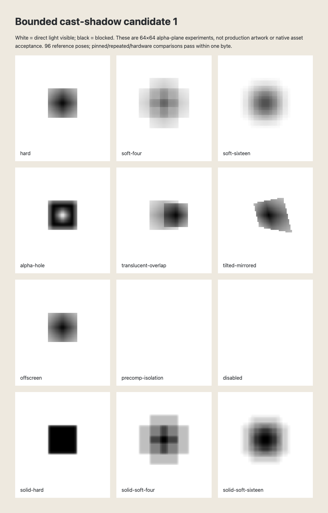

# CE8-L-F bounded cast shadows — candidate 1

**2026-10-05. Preparation only.** Owner resumed bounded inter-layer cast-shadow
design and isolated prototypes from CE7 `0e48388`. CE8 and CE8-L are absent at
this base; production integration and full CE8-L-F acceptance remain outstanding.
No schema, builder, renderer, inspector or legacy output changes are proposed here.
Advanced surface shading remains deferred. The main checkout's uncommitted CE8-L
plan was read only; this branch does not transplant or implement its milestones.

This specification complements the main plan's CE8-L follow-up: at most eight
scoped ambient/point/spot lights, flat geometric normals, opt-in receivers,
linear illumination before effects/mattes/opacity/blending, and default unlit
exactness. See [CE8 prerequisites](./composition-engine-plan.md#ce8--25d-layers-and-unified-camera).
The isolated model is `flat-alpha-shadow-candidate-1`, under
[`scripts/composition/cast-shadow-prototype`](../scripts/composition/cast-shadow-prototype/model.ts).
It is an experiment contract, **not** an extension to `composition-1`.

**Reviewable checkpoint (2026-10-06):** 96 frozen poses match CPU bytes exactly
on pinned software; 288 forward/reverse/random draws, 96 independent software
pixel/PNG repeats and 12 hardware comparisons pass. A separate maximum-input
probe also matches on both profiles and repeated software. Nine analytic tests
and focused static gates pass. No 1080p cost, native output or real export
acceptance is claimed. [Runner instructions](../scripts/composition/cast-shadow-prototype/README.md).

The original one-texel controls expose border filtering. The last row uses opaque
8² masks to distinguish hard from sampled soft shadows. Four samples produce
separated lobes; 16 still show discrete bands. These observations are retained
as quality limitations for owner review, not a claim of smooth production shadows.

## Asset inputs and authoring decisions

| Candidate input   | Caster alpha input                                                    | Receiver surface  | Integration status                               |
| ----------------- | --------------------------------------------------------------------- | ----------------- | ------------------------------------------------ |
| Image             | Existing pinned image alpha after mask/matte, before lighting/effects | CE8 image quad    | Adapter pending                                  |
| Solid             | Native solid fill alpha and mask/matte                                | CE8 solid quad    | Adapter pending                                  |
| Text              | Actual pinned font glyph alpha at the layer's selected CE7 clock      | CE8 text plane    | Font raster/clock adapter pending                |
| Native shape      | CE5 sampled/painted alpha after shape operators and masks/matte       | CE8 shape plane   | Raster adapter pending                           |
| Flattened precomp | Flattened instance's alpha at its selected clock                      | One CE8 host quad | Internal shadows flattened; no child propagation |

RGB never contributes to caster coverage. Hidden RGB in transparent image pixels
must not create a fringe. No new depth/normal asset is required. Prototype fixtures
use explicit tiny alpha rasters; they do **not** claim native image/text/shape or
precomp adapters have been exercised. Text and shapes require raster precision
and source-resolution acceptance before integration.

Proposed layer flags: `castsShadow: false` and `receivesShadow: false` by default.
The latter also requires CE8-L `receivesLight: true` and a supported 3D drawable.
Proposed point/spot light option: `{ enabled: false, radius: 0, samples: 1 }`.
Ambient cannot cast shadows. Radius has composition-pixel units; sample counts
are explicit 1, 4 or 16. Radius zero uses hard coverage regardless of requested
quality, but cache identity still retains the option. A spot uses CE8-L's cone and
range response at the receiver center; samples change visibility only. No broadening
of the spotlight cone by an emitter disk is implied.

Groups, nulls, adjustments, providers, cameras, lights, ordinary 2D layers and
media types outside this asset table are rejected if opted in. Initial casting
requires normal layer blending; multiply/additive art does not define physical
transmission. Host-layer effects, drop/inner/height shadows and blur do not change
caster alpha; effects already rendered inside a flattened precomp are part of its
source alpha. Motion blur and DOF are applied after per-sample shadow shading, never
used as blurred caster geometry. This choice needs owner confirmation before
production; effect-generated silhouettes are a future scope decision.

## Geometry and visibility

World coordinates follow the project: x right, y down, z away from viewer.
Represent each finite flat plane as origin O and full edge vectors U,V. The normal
is U×V. Parent transforms, mirrored scale, nonuniform scale and shear belong in
these vectors; use the inverse Gram matrix to recover UV, rather than assuming
unit or orthogonal bases. Singular/nearly collinear bases produce a diagnostic;
animated degeneracy must yield a deterministic empty caster/receiver with a
diagnostic, never NaN. The prototype rejects geometrically degenerate input and
float32-ill-conditioned bases at preflight: its float32 Gram determinant must
exceed `1e-6 * (U·U) * (V·V)`. Shader input construction runs the same validation
before any draw; rejected bases report `shadow-prototype-input: ill-conditioned plane`.

The candidate ±1e6 coordinate bound does not prove ≤0.001-pixel GPU precision.
Production needs receiver-relative rebasing and conditioning tests, or a tighter
validated range. Small prototype coordinates establish no large-world guarantee.

For receiver point R and emitter sample L, solve
`t = dot(N, O-R) / dot(N, L-R)`, with ray `R+t*(L-R)`. A blocker requires
`t*length(L-R) > 0.001` and `(1-t)*length(L-R) > 0.001` in world pixels.
The bias excludes coplanar/self contact and light-coincident planes. It is an
explicit candidate tolerance; thin gaps below it are intentionally suppressed.
Reject grazing rays when `abs(dot(N,ray)) <= 1e-6*length(N)*length(ray)`.
Zero-length rays are unblocked. Two-sided alpha planes occlude from either side;
CE8-L's front/back diffuse response remains its own contract. Shadows ignore
camera view/depth sorting; the geometric segment alone determines blockers.

Transform the hit to UV. Outside `[0,1)` on either axis gives zero alpha.
Inside, bilinearly interpolate 8-bit alpha at pixel centers with zero-valued
out-of-range taps. This transparent-border convention is intentional (a one-texel
mask has a half-alpha edge); do not silently substitute clamp-to-edge. Multiply
alpha by effective inherited caster opacity exactly once. Matte/mask alpha must
not include the same opacity again. Matting preparation must use the existing
acyclic matte dependency graph and instance clocks, without a shadow dependency
cycle. No receiver alpha contributes to blocker transmittance.

For each emitter sample, multiply `T = product(1 - casterAlpha)` in ascending
stable CE8 layer order, with ASCII layer-id tie-break. Then average T in fixed
sample-index order. **Average the product**, not independently averaged caster
coverage; the latter loses correlated soft-shadow overlap. Union coverage handles
overlapping translucent planes without creating new output alpha. Self id in the
same instance scope is ignored. No temporal history, seeded random choice, GPU
atomic sum or unordered reduction is allowed.

Candidate soft samples use the explicit symmetric disk tables in `model.ts`,
equal weights, no frame-dependent rotation/jitter and no trigonometric generation.
The standalone prototype's emitter disk is world XY. Production must orient it
using an explicit deterministic basis: for a spot, its evaluated world orientation;
for a point, a receiver-plane-aligned basis shared across the whole receiver.
Changing that basis or quadrature requires a model version. The 4/16 tables are
quality proposals, not proven smooth penumbrae; moving-edge banding/convergence
acceptance remains open. They need not converge monotonically at every pixel.

Forward geometry prototype: project caster vertex C from L to receiver plane.
For light z=0, caster z=10 and receiver z=20, `(2,3,10)` projects to `(4,6,20)`.
Near-horizon/behind-light or oversized projection returns no finite vertex. Do
not join valid vertices into a clipped quad when another vertex crosses a horizon.
Future scissor optimization must conservatively fall back to the entire receiver
viewport or fail the work budget. The shader prototype uses inverse rays over
the entire finite receiver, so it cannot lose shadows at this singularity.

Never cull a caster because it is outside the **camera** viewport: an offscreen
plane can cast onto an onscreen receiver. Cull only with conservative light-to-
receiver geometry at every emitter sample. Receiver shading is clipped to its
surface/viewport and alpha. Depth-sort ties retain CE8 order; the shadow pass
must not reorder layers, add a black overlay between them, or merge 3D islands
across intervening 2D layers.

## Colour, timing and boundaries

CE8-L computes ambient A and each direct contribution D in linear RGB. Integrate
`A + sum(D_light * visibility_light)` before receiver effects/matte/opacity/blend.
Ambient is never shadowed. Preserve receiver alpha exactly. Unpremultiply source
in its known encoding, decode sRGB where appropriate, illuminate, re-encode at
the existing shading boundary and premultiply once. Alpha zero has RGB zero;
do not divide by zero or change global compositing space. `shadeLinear` only
probes this boundary using already-linear premultiplied inputs; it is not a new
CE8-L colour pipeline. Multiple direct lights use CE8-L's stable light ordering.

All shadows disabled, receivers opted out, no enabled direct lights, or no eligible
casters must bypass the shadow path exactly; shader multiplication by 1 is not
sufficient evidence of unlit byte exactness. Existing 2D shadow-effect semantics
and versions remain unchanged. Canvas must diagnose a required production
shadow capability with `comp-feature-backend`; it must not silently omit it.

Each CE7 exposure graph supplies the **selected** poses/opacity/alpha source
clocks for receivers, casters and lights. Reuse `EvaluatedLayer.exposure.tree` and
`rootTime`, including opt-outs, posterization, holds, loop cuts and remapped
precomp instances. Do not resample all entities at one raw shutter time; CE7 can
select different clocks per layer. Accumulate completed shaded samples using
CE7's existing fixed order. Shadow disk count is orthogonal to shutter count.
Static-graph reuse must include all shadow inputs and selected content clocks.

Cache identity must retain the model/shader version, scoped light identity and
selected pose/cone/range/shadow options, receiver/caster identities and stable order,
world bases, flags, opacity, alpha raster hashes/resolution/filter convention,
mask/matte inputs, colour space and selected instance/content clocks. Texture reuse
can retain immutable source rasters, but not evaluated alpha/poses across clocks.

Lights and blockers share an exact composition-instance scope. Internal precomp
lights/shadows render inside that precomp; parent lights can shade its opted-in
flattened host plane using flattened alpha. No internal child blocks an outside
receiver. Different instances of the same definition never share evaluated
poses/alpha merely because they share a source id. Initial shadow opt-ins on
`collapseTransforms` precomps are rejected pending an explicit boundary contract;
do not infer propagation from today's collapsed render graph.

## Preliminary budgets — not measured acceptance

| Resource                     | Candidate production bound                                          | Isolated prototype bound      |
| ---------------------------- | ------------------------------------------------------------------- | ----------------------------- |
| All light layers             | CE8-L's 8 per scope, disabled included                              | One direct light              |
| Shadow-enabled direct lights | 4 per scope, disabled included                                      | One                           |
| Casters / receivers          | 8 each per scope, opted-in disabled included                        | 8 / one                       |
| Disk samples                 | 1 hard; 4 or 16 soft                                                | Same explicit tables          |
| Caster alpha raster          | 1024² maximum, pinned resolution policy required                    | 64² maximum                   |
| Alpha storage                | 8 MiB per scope in R8; 32 MiB if RGBA8 fallback                     | At most 8×64² RGBA8           |
| Extra shadow surfaces        | 32 MiB per scope at 1080p; streaming exposure                       | One 64² visibility canvas     |
| Work per exposure sample     | 96 million caster-sample evaluations over projected receiver pixels | 64² × 8 × 16 maximum          |
| Work per output frame        | 384 million evaluations across all CE7 samples                      | Small seek/fixture probe only |
| Preview / pinned export time | Propose ≤4 ms / ≤20 ms added 1080p median with p95 ≤2× median       | **No performance claim**      |

Work estimation sums `clippedReceiverPixels * eligibleCasters * lightSamples`
over each light/receiver/sample. The numerical maxima cannot all be used
simultaneously at full screen within this budget. Fail a stable budget diagnostic
with the required work and limit; never silently lower quality, truncate casters,
switch renderer or loosen an existing gate. Four bilinear texel taps per alpha
evaluation must be accounted for separately in instrumentation. DOF and exposure
surfaces retain their existing budgets. High-resolution/tiled outputs require
explicit separate acceptance. Proposed radius is 0–1000 world pixels, coordinates
bounded to ±1e6, opacity [0,1], and bounded ids/instance paths.

These limits and timing targets need owner selection plus isolated serial 1080p
measurements on both pinned export and actual hardware after CE8-L exists. The
64² experiment is correctness evidence only. No heavy timing experiments run
concurrently with the main lane's timing gates. CE6-P targets are unchanged.

## Acceptance fixtures and integration gates

Preparation acceptance: hand-computed projection/ray/alpha tests; isolated shader
versus CPU reference for fixed explicit alpha planes; hard/4/16 soft cases,
translucent overlap, alpha holes, tilted/mirrored/sheared planes, offscreen casting,
disabled visibility and instance isolation; frozen experimental reference bytes;
independent browser repeats and reverse/random pose seeking. These validate a
candidate algorithm, not production lighting, assets or export.

Before production integration is complete, require all of the following:

1. CE8 and CE8-L delivered with real transform, normal, light and clock contracts.
2. Owner chooses flags, alpha stage, two-sided/bias policy, disk orientation,
   quality/budget targets and collapsed-precomp rejection. Schema/property-path,
   animation, builder and inspector validation with stable existing diagnostics.
3. Native pinned image alpha (including nonzero RGB at alpha zero), solid, real text,
   CE5 shape and flattened-precomp fixtures; opaque/half/zero receiver alpha,
   mask/matte and nested repeated/remapped instance tests. No alpha drift/fringes.
4. Analytic perpendicular/tilted/parented/grazing/light-between/coplanar/offscreen
   geometry; spot cone/range edges; multiple lights and correlated soft overlap;
   fixed noise-free penumbra motion. CPU/shader geometry error ≤0.001 world pixel.
5. Provisional CPU/shader visibility tolerance ≤1 byte at 64² for these fixtures;
   separately approve native raster tolerance under existing parity tiers.
   Disabled-shadow native output exact to original bytes; frozen legacy CE0
   baselines unchanged. No baseline regeneration to mask a failure.
6. Deterministic forward/reverse/random seeks and repeated independent **real**
   preview/CLI exports with per-frame hashes and pinned environment fingerprints.
   Hardware versus pinned export within the existing GPU policy; no synthetic
   browser PNG probe can replace full production export acceptance.
7. CE7 selected/held clocks, exposure cuts, opted-out lights/casters/receivers,
   blur accumulation, CE8 depth order/DOF and cache invalidation regressions.
8. Serial 1080p light/caster/receiver/sample matrix costs and memory/work peaks;
   owner accepts demonstrated budgets. Full final local verification after
   focused regression/review. GitHub Actions stay disabled.

Normal-map relighting, inferred depicted geometry, PBR/specular materials,
reflections, self-shadowing, ambient occlusion and volumetric lighting are outside
this resumed scope. See [preparation evidence](./composition-ce8lf-results.json)
for actual commands/results, failed attempts and remaining checks.
