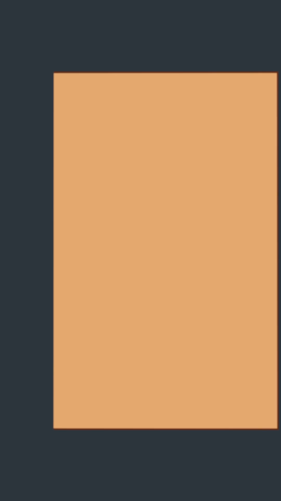
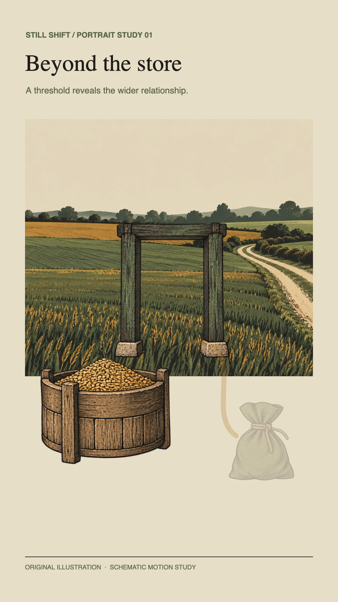
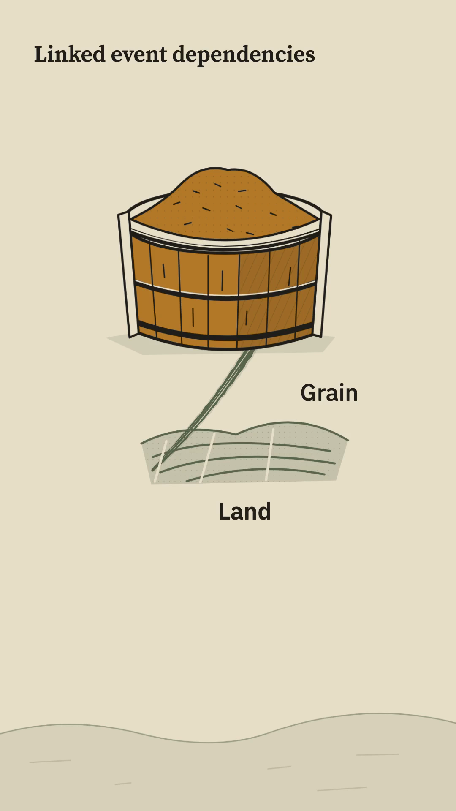
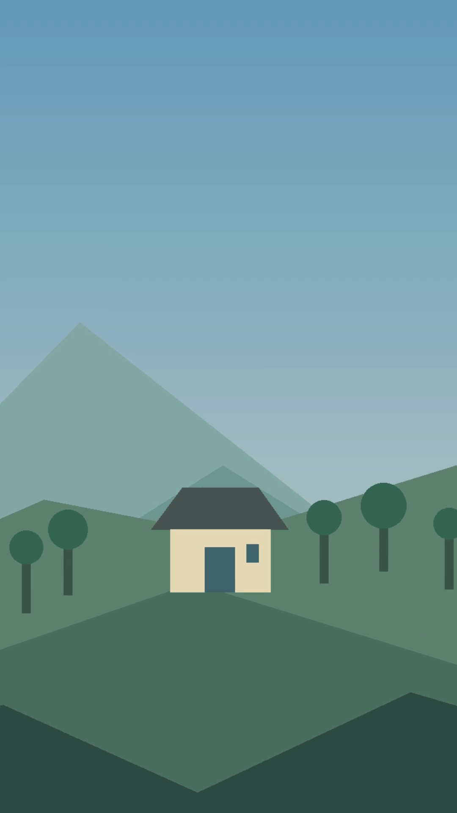

# Vertical video review gallery

These are decoded frames from 1080×1920 H.264 exports. The fixtures are engine
checks and schematic demonstrations, not finished episode artwork.

| Depth crop                                         | Illustrated layers                                               | Story passage                                              | Cinematic camera                                     |
| -------------------------------------------------- | ---------------------------------------------------------------- | ---------------------------------------------------------- | ---------------------------------------------------- |
|  |  |  |  |

Commerce portrait alias: 

## Capture sources

- **Depth:** [durable synthetic focal image](../../../benchmarks/fixtures/depth-image/vertical/focal-block.png) exercised by the [vertical image browser smoke](../../../tests/browser/vertical-image.ts), with the orange block retained by the vertical crop. Run `node --import tsx tests/browser/vertical-image.ts --capture docs/review/vertical-video/depth-focal-reframe.png` to reproduce it.
- **Illustrated:** [authored vertical Chronicle Reveal](../../../benchmarks/fixtures/history-offstage-v2/vertical/chronicle-reveal.json), frame 96 of 168. The art uses the original layered fixture assets. Run `pnpm still-shift animate-scene --scene benchmarks/fixtures/history-offstage-v2/chronicle-reveal.json --format vertical --output <new.mp4>` and decode frame 96.
- **Story:** [dual-format Linked Network plan](../../../benchmarks/fixtures/story-authoring/vertical/linked-network.json), frame 45 of 192. Its copied template has an explicit `formats.vertical` layout; the same plan and cue timeline resolves to either format. Run `pnpm story:passage --plan benchmarks/fixtures/story-authoring/vertical/linked-network.json --format vertical --output-dir <new-dir> --silent` and decode frame 45.
- **Commerce:** [H01 portrait fixture](../../../benchmarks/fixtures/ecommerce-motion/vertical/h01-portrait.json), frame 150 of 240. The catalog maps the H01 landscape entry to this existing portrait layout. Run `pnpm still-shift animate-scene --scene benchmarks/fixtures/ecommerce-motion/h01-landscape.json --format vertical --output <new.mp4>` and decode frame 150.

## Cinematic provenance

- **Source:** [`ci-vertical-rising-vista.json`](../../../benchmarks/fixtures/cinematic-illustrated/vertical/ci-vertical-rising-vista.json)
- **Art provenance:** Deterministic geometric layers generated by [`generate.py`](../../../assets/cinematic-illustrated/kit-v-vertical/generate.py). This is an engine acceptance fixture, not production artwork.
- **Capture:** Frame 48 of a 96-frame, 24 fps H.264 export at 1080×1920. The PNG was decoded from the video with FFmpeg; it is not a direct canvas screenshot.
- **Verification:** `node --import tsx tests/browser/vertical-cinematic.ts --capture docs/review/vertical-video/cinematic-rising-vista.png` exported the fixture, verified dimensions and frame count with ffprobe, and extracted the frame. Verified 2026-09-27.
