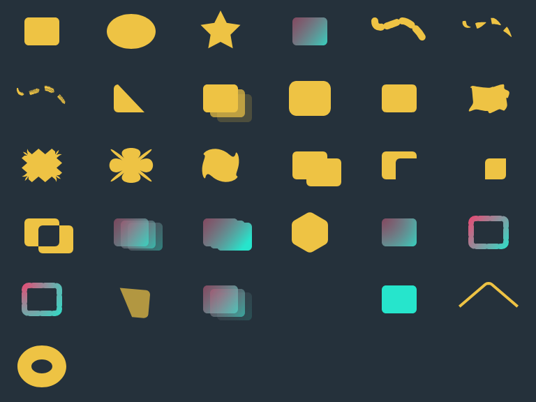

# Native shape baselines (CE5)

These are new CE5 baselines; the frozen CE0 inventory is separate and unchanged.
The platform JSON stores full RGBA SHA-256 values for every forward frame on both
Canvas and WebGL. The test compares every reverse seek to those same hashes,
checks the unchanged near tier between backends, verifies legacy connector/nib
appearance, rejects geometry-overflow exports and checks native inspector edits.

Run `pnpm test:browser:composition-shapes` to check. The explicit
`--write-ce5-baseline` option writes only this directory's new native baseline.
Do not use it to hide an unexpected regression. PNGs show first, middle and last
Canvas frames of the reference, animation and connector fixtures.

Cells are 128×96 pixels, six columns, left to right and top to bottom:

| Cell | Case                     |
| ---- | ------------------------ |
| 1    | rect                     |
| 2    | ellipse                  |
| 3    | star                     |
| 4    | gradient                 |
| 5    | stroke-plain             |
| 6    | stroke-ink               |
| 7    | stroke-brush             |
| 8    | trim-paths               |
| 9    | repeater                 |
| 10   | offset-path              |
| 11   | round-corners            |
| 12   | wiggle-paths             |
| 13   | zig-zag                  |
| 14   | pucker-bloat             |
| 15   | twist                    |
| 16   | merge-union              |
| 17   | merge-subtract           |
| 18   | merge-intersect          |
| 19   | merge-exclude            |
| 20   | painted-repeat-gradient  |
| 21   | compound-repeat-gradient |
| 22   | polygon                  |
| 23   | radial-fill              |
| 24   | linear-stroke            |
| 25   | radial-stroke            |
| 26   | painted-group-trim       |
| 27   | painted-group-repeat     |
| 28   | zero-size                |
| 29   | zero-gradient            |
| 30   | signed-open-offset       |
| 31   | even-odd-hole            |

The reference covers every primitive, four paint types, all nine operators and
four Boolean modes, group transforms/opacity, repeated gradients, dashes, holes
and degenerate cases. The 96-frame animation combines closed first-vertex-aligned
Bézier morphing, animated trim offset/end and seeded wiggle. MP4 acceptance compares
independent preview encoding and both PNG/raw transports on each backend.
